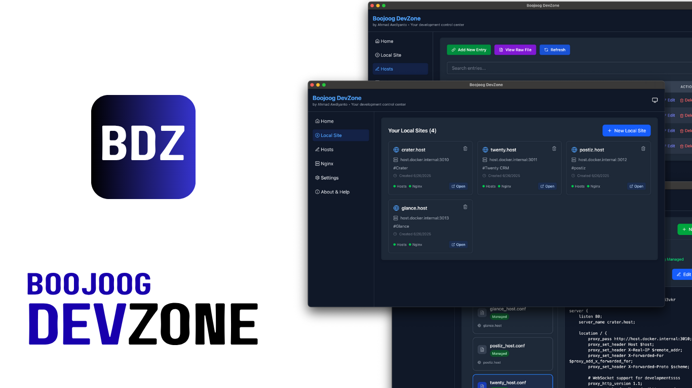

# Boojoog DevZone

<div align="center">
  
</div>

<div align="center">
  <strong>A modern, comprehensive development environment manager for Windows, macOS, and Linux.</strong>
  <br>
  <em>DevZone streamlines your local development workflow by providing an intuitive interface to manage hosts files, nginx configurations, and local development sites all in one place.</em>
</div>

<br>

<div align="center">

[](https://github.com/psudocode/boojoog-devzone/releases)
[](https://opensource.org/licenses/MIT)
[](https://github.com/psudocode/boojoog-devzone/issues)
[](https://github.com/psudocode/boojoog-devzone/stargazers)

</div>

> **Free & Open Source** - Boojoog DevZone is completely free to use and open source under the MIT License. No subscriptions, no limitations, no data collection.

## Download

### Pre-built Releases

Download the latest version for your platform from the [Releases page](https://github.com/psudocode/boojoog-devzone/releases):

- **macOS**: `.dmg` installer
- **Windows**: `.exe` installer
- **Linux**: `.AppImage` portable app

### Build from Source

See the [Development Setup](#development-setup) section below.

## Features

### 🏠 Local Sites Management

- Create and manage local development sites with ease
- Automatic hosts file entries and nginx configuration generation
- Integrated workflow for setting up complete local development environments

### 🔧 Hosts File Management

- View and edit your system hosts file with administrative privileges
- Add, edit, and delete host entries with a clean interface
- Search functionality to quickly find entries
- View raw hosts file content
- Test links directly from the application

### 🌐 Nginx Configuration

- Create and manage nginx virtual host configurations
- Template-based configuration generation
- Seamless integration with local site setup

### ⚙️ System Integration

- Cross-platform support (Windows, macOS, Linux)
- Safe administrative privilege handling
- Persistent settings and preferences

## Technology Stack

This application is built with modern web technologies:

- **Frontend**: React 18 with TypeScript
- **Desktop Framework**: Electron 30
- **State Management**: Jotai for reactive state
- **Styling**: TailwindCSS 4 with dark mode support
- **Routing**: React Router DOM
- **Build Tool**: Vite for fast development and building
- **Icons**: Lucide React for consistent iconography
- **Cross-platform**: Electron Builder for app distribution

## Development Setup

### Prerequisites

- Node.js (version 16 or higher)
- npm or yarn package manager

### Installation

```bash
# Clone the repository
git clone https://github.com/psudocode/boojoog-devzone.git

# Navigate to the project directory
cd boojoog-devzone

# Install dependencies
npm install

# Start the development server
npm run dev
```

### Available Scripts

- `npm run dev` - Start the development server with hot reload
- `npm run build` - Build the application for production
- `npm run lint` - Run ESLint for code quality checks
- `npm run preview` - Preview the built application

### Project Structure

```
src/
├── components/     # Reusable UI components
├── pages/         # Application pages/views
├── atoms/         # Jotai state atoms
├── helpers/       # Utility functions
├── hooks/         # Custom React hooks
└── ui/           # UI-specific components

electron/
├── main.ts       # Electron main process
├── preload.ts    # Preload script for security
└── app/          # Application logic
    ├── hosts/    # Hosts file management
    ├── nginx/    # Nginx configuration
    └── settings/ # Application settings
```

## Building for Production

The application uses Electron Builder for creating distributable packages:

```bash
# Build for current platform
npm run build

# The built application will be in the release/ directory
```

## System Requirements

- **macOS**: macOS 10.15 or later
- **Windows**: Windows 10 or later
- **Linux**: Ubuntu 18.04 or equivalent

## Permissions

Boojoog DevZone requires administrative privileges to:

- Read and write to the system hosts file
- Manage nginx configuration files
- Access system directories for local development setup

## Contributing

We welcome contributions! Here are some ways you can help:

### 🐛 Bug Reports

- Use the [GitHub Issues](https://github.com/psudocode/boojoog-devzone/issues) to report bugs
- Include your OS, app version, and steps to reproduce

### 💡 Feature Requests

- Suggest new features via [GitHub Issues](https://github.com/psudocode/boojoog-devzone/issues)
- Check existing issues to avoid duplicates

### 🔧 Code Contributions

1. Fork the repository
2. Create a feature branch (`git checkout -b feature/amazing-feature`)
3. Make your changes and add tests if applicable
4. Commit your changes (`git commit -m 'Add some amazing feature'`)
5. Push to the branch (`git push origin feature/amazing-feature`)
6. Open a Pull Request

### 📝 Documentation

- Help improve the README, add screenshots, or write tutorials
- Documentation improvements are always welcome!

## Support

- **GitHub Issues**: For bug reports and feature requests
- **Discussions**: For questions and community support
- **Wiki**: For extended documentation and guides (coming soon)

## Roadmap

- [ ] Docker container management integration
- [ ] Apache virtual host support
- [ ] Custom domain SSL certificate management
- [ ] Backup and restore configurations
- [ ] Plugin system for extensibility
- [ ] Mobile companion app for remote management

## Acknowledgments

- Built with [Electron](https://www.electronjs.org/) and [React](https://reactjs.org/)
- Icons by [Lucide](https://lucide.dev/)
- Inspired by the need for better local development tools and the Boojoog development philosophy

## License

This project is licensed under the MIT License - see the LICENSE file for details.
